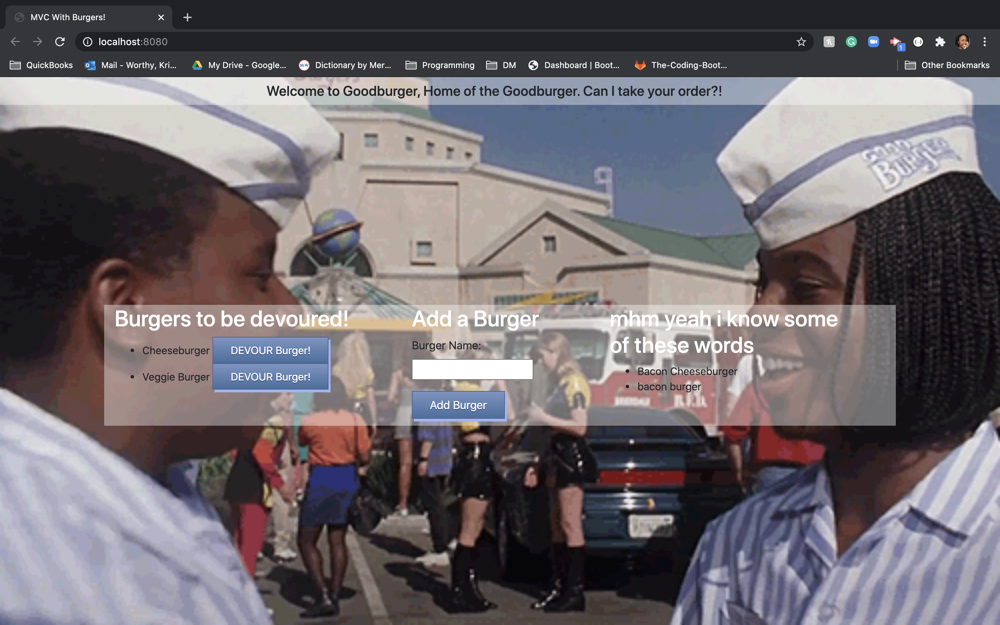

# burger

  ## Description
  In this assignment, I was tasked to create a burger logger with MySQL, Node, Express, Handlebars and an ORM. Also, the theme of this assignment was inspired by the movie "Good Burger".

  ## Table of Contents

  * [Installation](#Installation)
  * [Usage](#usage)
  * [License](#License)
  * [Tests](#Test)
  * [Link](#Link)
  * [Questions](#Questions)

  ## Installation

  npm i

  ## Usage
  Write in the burger name text area any type of burger, then click "add burger". And the burger that you entered in the text field will populuate to the left side of the screen in the section, "Burgers to be devoured". Once you click "DEVOUR Burger", the burger that you've devoured will populate to the right side of the screen in the section, "mhm yeah I know some of these words"

   

  ## License

  

  ## Link
  [Click Here to see the deployed site!](https://peaceful-ocean-64199.herokuapp.com/)

  ## Questions
  If you have any questions, please contact me on [GitHub](http://github.com/oksimone), Or, email me at ksworthy22@gmail.com
